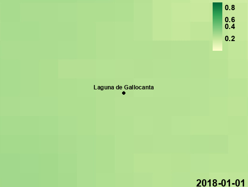
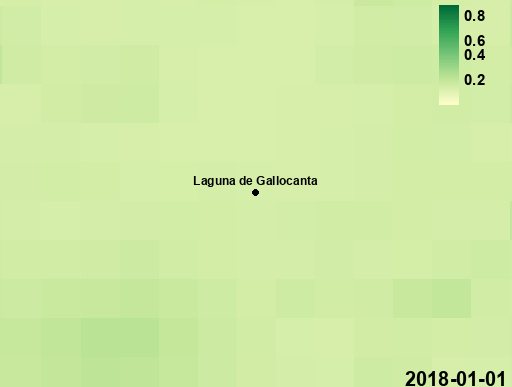

# SatAsAService - Análisis de Datos Satelitales con Google Earth Engine

> #### ⚠️ IMPORTANTE:
> Este proyecto combina imágenes de **Sentinel-2** y datos climáticos de **ECMWF ERA5-Land** para la extracción de índices de vegetación y humedad del suelo. Se implementa en **Google Earth Engine (GEE)** y permite la visualización y análisis de datos geoespaciales en áreas específicas.

## **Tabla de contenidos**
1. [Descripción del Proyecto](#descripción-del-proyecto)
2. [Estructura del Proyecto](#estructura-del-proyecto)
3. [Instalación y Configuración](#instalación-y-configuración)
4. [Uso del Proyecto](#uso-del-proyecto)
    - [Configuración](#configuración-del-proyecto)
    - [Ejecución del Script Principal](#ejecutar-el-script-principal)
5. [Procedimiento del Análisis Satelital](#procedimiento-del-análisis-satelital)
6. [Visualización de Series Temporales](#visualización-de-series-temporales)
    - [Índices de Vegetación (Sentinel-2)](#índices-de-vegetación-sentinel-2)
    - [Humedad del Suelo (ERA5-Land)](#humedad-del-suelo-era5-land)
7. [Funcionalidades Adicionales](#funcionalidades-adicionales)
8. [Ejemplos de Resultados](#ejemplos-de-resultados)

## **Descripción del Proyecto**
El sistema permite:
- 📡 **Procesar imágenes satelitales de Sentinel-2** y aplicar máscaras de nubes.
- 📊 **Extraer series temporales** de índices como **NDVI, NDMI, NDWI, NDSI**.
- 🌱 **Analizar humedad del suelo** desde ERA5-Land en diferentes capas de profundidad.
- 🗺️ **Visualizar datos en un mapa interactivo** con soporte para múltiples capas.
- 🎞️ Generar animaciones GIF mediante composiciones mensuales, con leyendas, fechas y marcadores geográficos.
- 🔀 Fusionar múltiples GIFs a través de un menú interactivo.

---

## **Estructura del Proyecto**
```bash
├── 📂 src
│   ├── 🛰️ auth.py             # Autenticación de Google Earth Engine
│   ├── 🛰️ config.py           # Configuración de AOI, fechas y parámetros de visualización
│   ├── 🛰️ main.py             # Script principal para ejecutar el flujo completo
│   ├── 🛰️ processing.py       # Procesamiento de imágenes y cálculo de índices
│   ├── 🛰️ time_series_extraction.py  # Extracción de datos temporales
│   ├── 🛰️ point_extraction.py        # Extracción de valores en puntos específicos
│   ├── 🛰️ visualization.py    # Creación del mapa interactivo
│   ├── 🛰️ plot_time_series.py # Visualización de series temporales con Plotly
│   ├── 🛰️ gif_gen.py          # Funciones para la generación y fusión de GIFs animados.
│   ├── 🛰️ requirements.txt    # Dependencias necesarias para ejecutar el proyecto
```

## **Instalación y Configuración**
### **1. Clonar el repositorio**
```bash
git clone https://gitlab.i3a.es/howlab/software/python/satellite/satasaservice.git
cd satasaservice
```
### **2. Crear un entorno virtual y activar dependencias**
```bash
python -m venv .venv
source .venv/bin/activate  # En Linux/Mac
# En Windows:
# .venv\Scripts\activate

pip install -r requirements.txt
```

## Uso del Proyecto

### Configuración del Proyecto
El primer paso, antes de ejecutar el script principal, será acceder a auth.py y modificar el valor de la variable "USER_PROJECT" introduciendo el nombre del proyecto habilitado por Google Earth Engine.

### Ejecutar el Script Principal
```bash
python main.py
```
Al ejecutar, se mostrará un menú interactivo con las siguientes opciones:

1. **Procesar datos satelitales**  
   - Se obtienen imágenes ópticas de **Sentinel-2** y datos climáticos de **ERA5-Land** desde **Google Earth Engine (GEE)**.  
   - Se aplican filtros de fecha y región de interés, aplicando máscaras de nubes y cálculo de índices.

2. **Extraer datos de series temporales**  
   - Extrae datos semanales o mensuales de los índices (como NDVI, NDMI, NDWI, NDSI) y humedad del suelo en puntos específicos, guardándolos en archivos CSV.

3. **Generar gráficos de series temporales**
   - Crea gráficos interactivos (usando Plotly) que muestran la evolución de los índices para cada ubicación.

4. **Crear mapa interactivo**  
   - Genera un mapa interactivo HTML usando geemap.
   - Incluye diversas capas (p.ej., Sentinel-2 True Color, NDVI, NDMI, etc.) junto con marcadores y áreas de interés.

5. **Generar GIFs**  
   - Genera animaciones GIF a partir de composiciones mensuales de la zona de Gallocanta.  
   - Cada fotograma incluye la fecha, una barra de colores (leyenda) y un marcador geográfico.  

6. **Fusionar GIFs**  
   - Permite al usuario seleccionar múltiples archivos GIF para fusionarlos en una sola animación.

7. **Ejecutar todo el proceso**  
   - Ejecuta secuencialmente todos los pasos anteriores.

8. **Salir**  
   - Finaliza el programa.
   - 
> ### 📝 NOTA:
> Algunos pasos tienen dependencias lógicas; por ejemplo, las opciones 2, 3 y 4 requieren que se ejecute la opción 1, y la opción 3 también requiere que se haya ejecutado la opción 2.

### Procedimiento del análisis satelital

El proceso de análisis satelital en este proyecto sigue los siguientes pasos:

1. **Descarga y procesamiento de Datos**  
   - Se descargan imágenes de **Sentinel-2** y datos de **ERA5-Land** mediante GEE.  
   - Se aplican filtros de fecha y AOI, y se procesan imágenes para aplicar máscaras de nubes y calcular índices.

2. **Extraer datos de series temporales**  
   - Extrae datos semanales o mensuales de los índices (como NDVI, NDMI, NDWI, NDSI) y humedad del suelo en puntos específicos, guardándolos en archivos CSV.

3. **Extracción de Humedad del Suelo (ERA5-Land)**
   - Se extraen datos de humedad en varias capas de profundidad (ej. 0-7 cm, 7-28 cm, 28-100 cm, 100-289 cm).

4. **Extracción de Series Temporales**  
   - Se extraen y agrupan datos (semanales o mensuales) para puntos de interés, y se guardan en un CSV.

5. **Visualización de Mapas**  
   - Creación de mapas interactivos en HTML.  
   - Con varias capas de información y herramientas de exploración espacial.  

6. **Visualización de Series Temporales**  
   - Generación de gráficos interactivos con **Plotly** que permiten comparar la evolución de índices y la humedad entre varias ubicaciones.

7. **Generación y Fusión de GIFs**  
   - Se crean animaciones GIF a partir de composiciones mensuales de la zona de **Gallocanta**.
   - Cada fotograma del GIF incluye leyendas, fechas y un marcador, y se pueden fusionar múltiples GIFs mediatne un menú.

## **Visualización de Series Temporales**
Los gráficos generados por **Plotly** permiten:

- **Visualizar la evolución de índices de vegetación** en cada punto.
- **Comparar la humedad del suelo** en diferentes capas de **ERA5-Land**.
- **Guardar gráficos como archivos `.html` y `.png`** para su análisis.

### **Índices de Vegetación (Sentinel-2)**
**Índices disponibles**:
- **NDVI** (*Índice de Vegetación Normalizado*) 🌿
- **NDMI** (*Índice de Humedad de la Vegetación*) 💧
- **NDWI** (*Índice de Agua Normalizado*) 💦
- **NDSI** (*Índice de Nieve Diferencial*) ❄️

### **Humedad del Suelo (ERA5-Land)**
**Capas de humedad del suelo**:
- **0-7 cm** *(capa superficial).*
- **7-28 cm.**
- **28-100 cm.**
- **100-289 cm** *(capa profunda).*

## Funcionalidades Adicionales
- Menú interactivo:
El script `main.py` presenta un menú interactivo que permite a los usuarios ejecutar cada paso del proceso de forma independiente o ejecutar el proceso completo.
- Manejo de errores y reconexión:
Se han implementado mecanismos para comprobar el estado del proceso (barras de carga), y reintentar y reconectar a GEE en caso de expiración del token o errores en la descarga.
- Modularidad:
El proyecto está organizado en módulos claramente definidos que facilitan su mantenimiento y expansión.

## Ejemplos de Resultados

A continuación se muestran algunos de los GIF generados durante el proceso:

### Evolución de la Laguna de Gallocanta (Sentinel)


*En este GIF se observa la evolución de NDMI (Índice de Humedad) calculado a partir de imágenes de Sentinel-2.*

### Evolución de la Humedad del Suelo (Capa Superficial)



*En este GIF se muestra la capa superficial (0-7 cm) de humedad del suelo proveniente de ERA5-Land.*  Como para el caso de Sentinel, se observan cambios estacionales (mayor humedad en otoño e invierno).  

### Evolución de la Humedad del Suelo (Capa ~2m)



*Aquí se ilustra la capa de 28-100 cm (o la profundidad que corresponda) de humedad del suelo de ERA5-Land.* A 2 metros de profundidad los cambios son menos notables debido a mantenimiento del nivel de agua por filtraciones y paso del tiempo, variando más lentamente.

> ### 📝 NOTA:
> Este proyecto usa Google Earth Engine y requiere una cuenta autorizada para acceder a los datos.

> ### 🚨 WARNING:
> Los datos de Sentinel-2 están disponibles desde 2017, mientras que ERA5-Land tiene datos desde 1950.